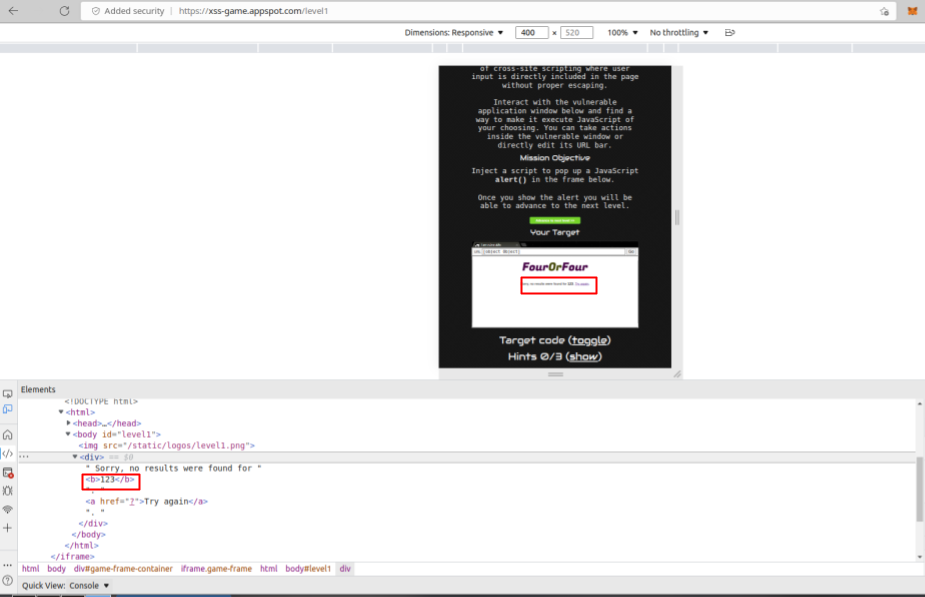

# Level-1

## 攻擊原理

#### 觀察一下 Response:
- 仔細看 response 的結構
- 看起來是把 request 的資料終於貼上 HTML tag 了
- 那假設 request 得資料，是 <script> 呢？



## 攻擊方法
在 Inout field 中插入
```
<script>alert("hello");</script>
```

## 截圖

