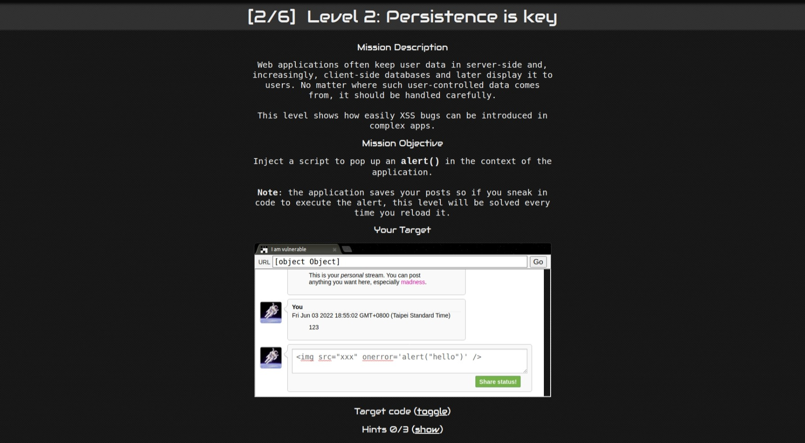

# Level-2

## 攻擊原理

#### 網頁原始碼:
- index.html

#### Make request:
- 從以下的片段看得出來，post-store.js 負責將 input data 儲存至 DB

```html=
<!-- This is our database of messages -->
<script src="/static/post-store.js"></script>
```

#### Push request:
- 送 POST 的時候沒有做任何的教驗，赤裸送出！

```javascript=
function Post(message) { 
  this.message = message;
  this.date = (new Date()).getTime();
}
```

#### Get response:
- 收 response 時，也直接將 data 放置到 innerHTML

```html=
html += '<b>You</b>';
html += '<span class="date">' + new Date(posts[i].date) + '</span>';
html += "<blockquote>" + posts[i].message + "</blockquote";
html += "</td></tr></table>"
containerEl.innerHTML += html; 
```

#### innerHTML:
- innerHTML 將字串串解析爲 HTML
- 意思是，如果字串串中有腳本 (script) ，瀏覽器就有可能會執行
- 但為什麼 `<script>` 在 innerHTML 中還是無法執行呢？
- 讀完 [Mozilla 官方文件](https://developer.mozilla.org/en-US/docs/Web/API/Element/innerHTML)
- 我們知道 `<script>` 在 innerHTML 中是無法執行的，僅此而已
- 但官方文件也有說，evet 是可以執行的

```
However, there are ways to execute JavaScript without using <script> elements, so there is still a security risk whenever you use innerHTML to set strings over which you have no control. For example:
```

```html=
const name = "";
el.innerHTML = name; // shows the alert
```

## 攻擊方法
在 Input field 中插入
```

```

## 截圖

