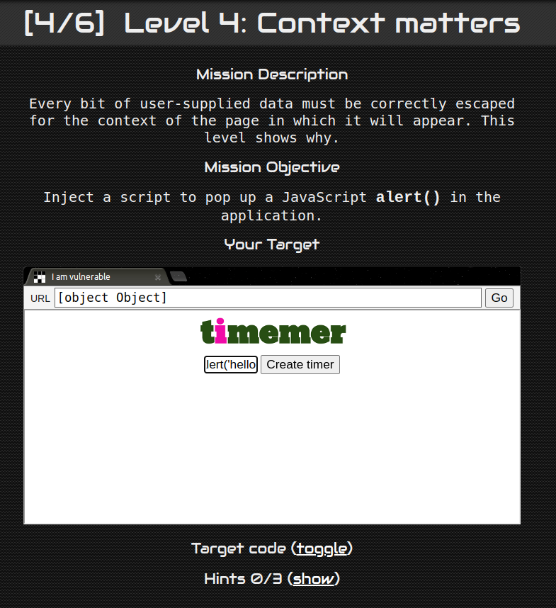
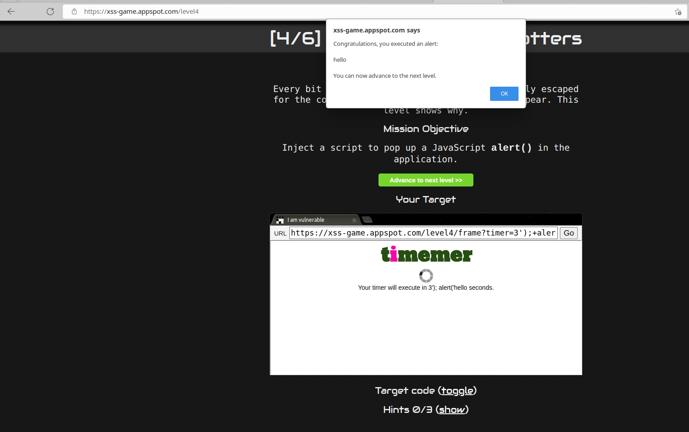

# Level-4

## 攻擊原理

#### 原始碼
- index.html

#### 手法:
- 讓 setTimer 也吃的下 alert

```javascript=
startTimer(‘3’); alert('hello');
```

## 攻擊方法
- 在 input field 中插入

```
3'); alert('hello

```

## 截圖

#### Request:


#### Response:

